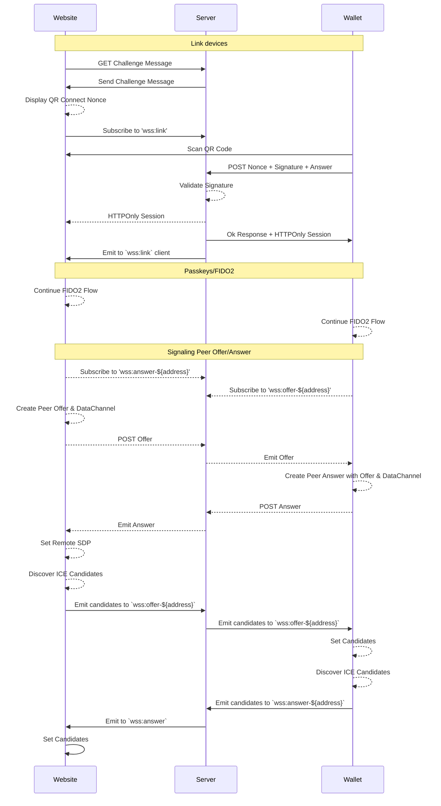

# Overview

Communicating across platforms in a decentralized manner

## Decisions

- Limit dependency on WebSockets to signaling
- Allow bidirectional communication between peers
- Enforce locality of device?

## Implementation

A WebSocket Service should establish the SDP handshake and emit ICE candidates for WebRTC clients.

This implementation should replace Wallet Connect with the following sequence

*Note: This process may be deprecated in the future in favor of `libp2p` which allows for an agnostic discovery layer and also supports the WebRTC transport
