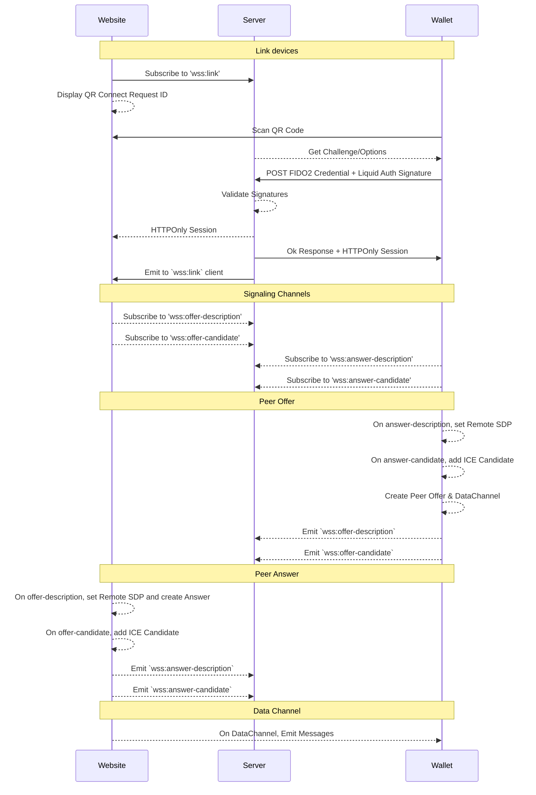

# Overview

Deprecate ARC-31/Arbitrary Auth Message in favor of custom FIDO2 extension

## Decisions

- Remove connect module and endpoints
- Use FIDO2 Attestation/Assertions for device linking

## Implementation

*Note: It may be possible to handle signaling in a fully decentralized manner in the future. 
