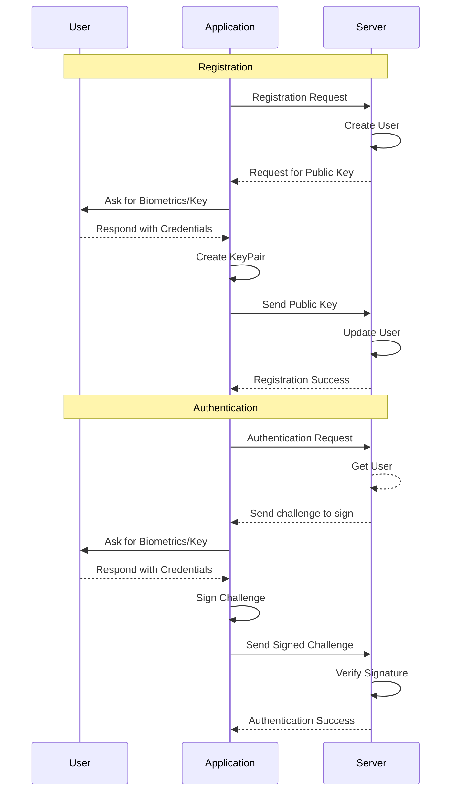

## Authentication

```mermaid
sequenceDiagram
    participant User
    participant Application
    participant Server
    Note over User, Server: Registration
    Application->>Server: Registration Request
    Server->>Server: Create User
    Server-->>Application: Request for Public Key
    Application->>User: Ask for Biometrics/Key
    User-->>Application: Respond with Credentials
    Application->>Application: Create KeyPair
    Application->>Server: Send Public Key
    Server->>Server: Update User
    Server-->>Application: Registration Success
    
    Note over User, Server: Authentication
    Application->>Server: Authentication Request
    Server-->>Server: Get User
    Server-->>Application: Send challenge to sign
    Application->>User: Ask for Biometrics/Key
    User-->>Application: Respond with Credentials
    Application->>Application: Sign Challenge
    Application->>Server: Send Signed Challenge
    Server->>Server: Verify Signature
    Server-->>Application: Authentication Success
    
```
