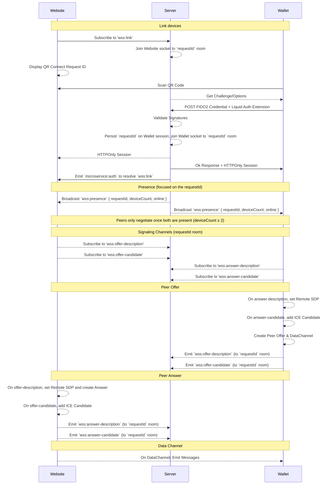
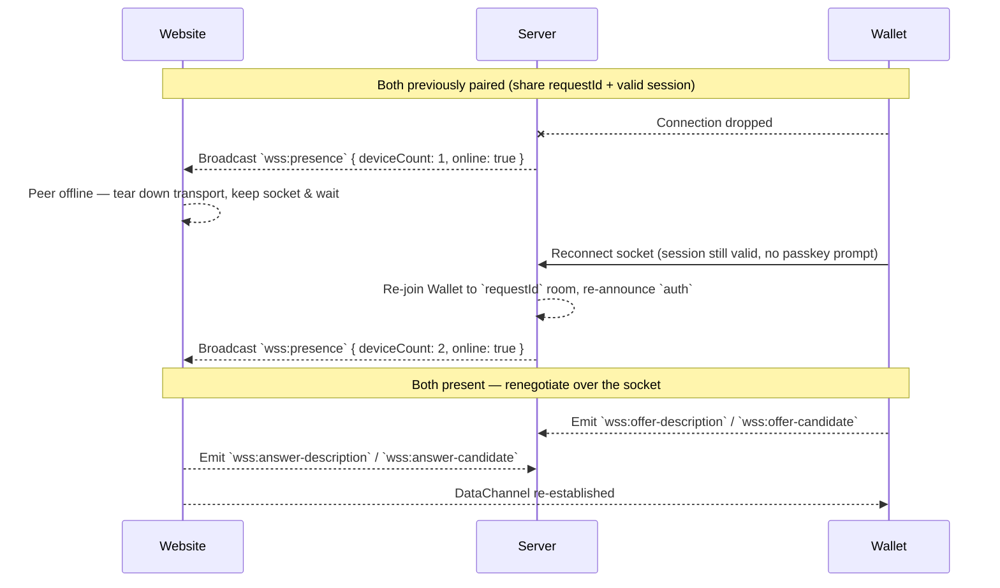

## Sequence Diagram

All signaling for a pairing is keyed on the `requestId`. When a client subscribes to
`wss:link` (or a wallet authenticates against a `requestId`) its socket joins the
`requestId` room. Session Descriptions and ICE Candidates are then brokered to that
room, so negotiation no longer depends on the wallet address and works before the
peer has authenticated.

## Presence & Reconnection

Every connection change broadcasts a `wss:presence` event to the `requestId` room so
peers can tell whether the other party is available before attempting to (re)negotiate.
`deviceCount` counts distinct devices (collapsed by session id, so one device that owns
several sockets is only counted once), and `online` is `true` when at least one device
is present. `GET /auth/session` reports the same live `deviceCount`. An offline client
uses this to decide whether it should even attempt to reconnect.

Because both peers persist the `requestId` and the wallet keeps a valid session, a
dropped connection is renegotiated over the existing socket without a fresh passkey
prompt: the server re-announces `auth` when a bound wallet reconnects (or when the peer
links while the wallet is already present), and both sides re-run the offer/answer
exchange in the `requestId` room.

