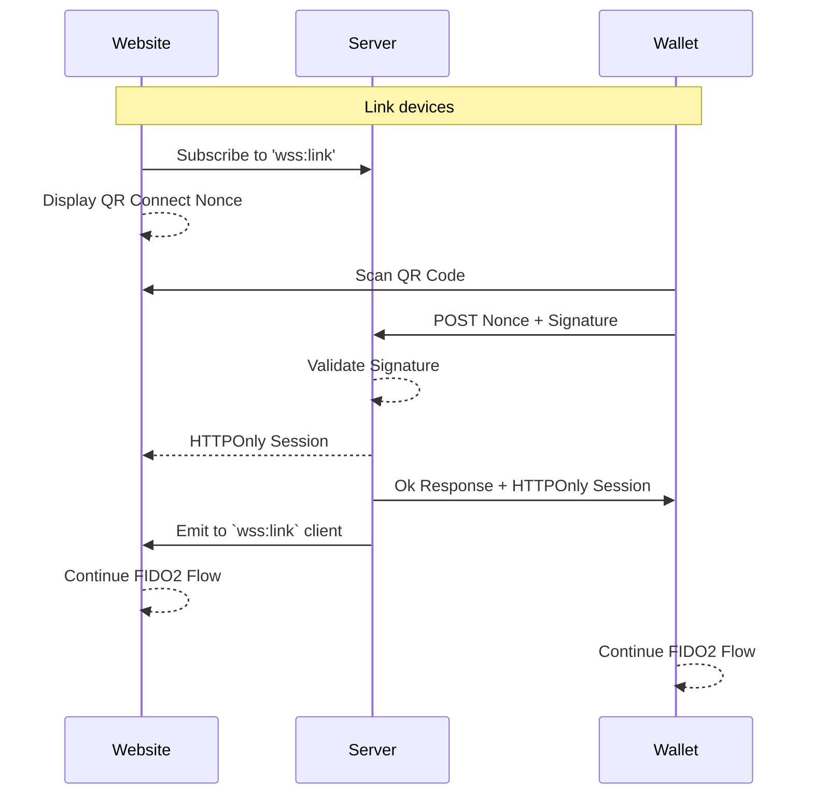

# Overview

Communicating across platforms

## Decisions

- Remove dependency on Wallet Connect
- Attest the knowledge of a wallet private key (ARC-31-Discussion)
- Guard credential creation

## Implementation

Sessions should be guarded by the "proof of knowledge" of a wallet's private key. Currently
there is a heavy reliance on Wallet Connect for communicating with Wallets. 

This implementation should replace Wallet Connect with the following sequence

Once the session is attested to by the wallet private key, we allow for credential creation.
This limits the knowledge emitted by the wallet keys to only the `nonce` for connecting. The only time
the private key of the wallet is required is when registering credentials on a new device. 

*Note: This process may be deprecated in the future in favor of `passkeys` which also support FIDO2 credentials with an 
additional hybrid cross-platform authenticator.
