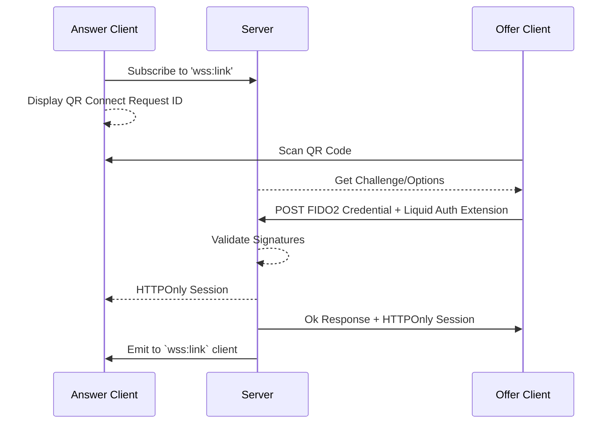
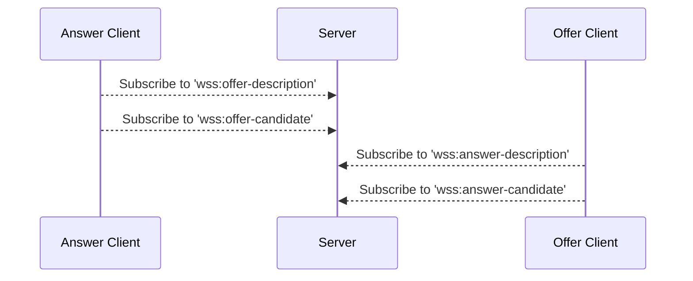
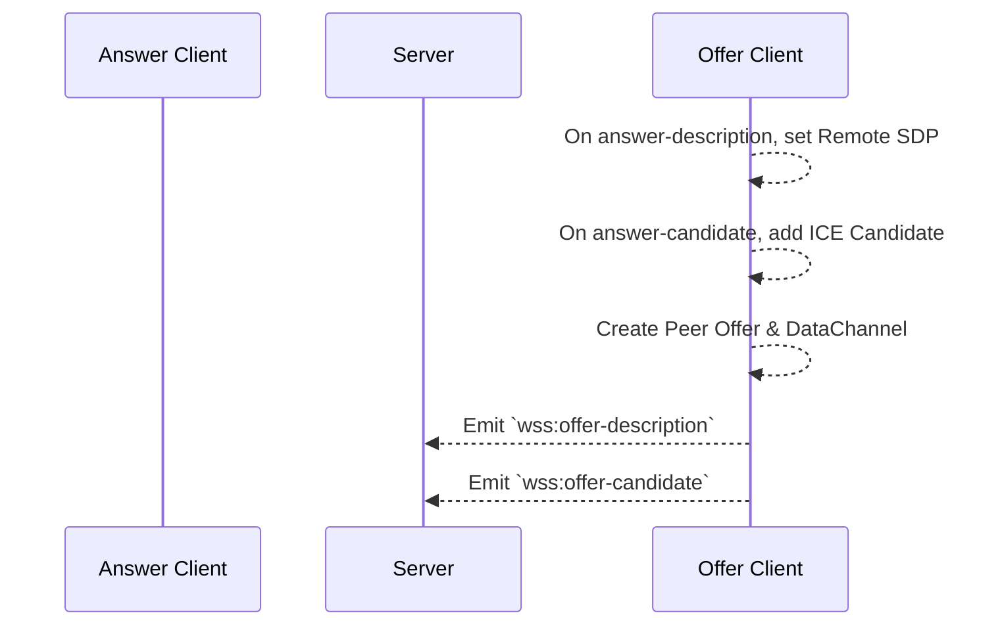
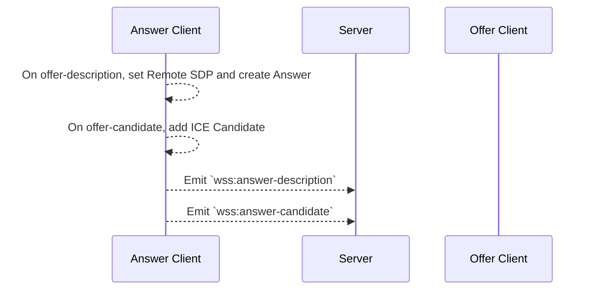
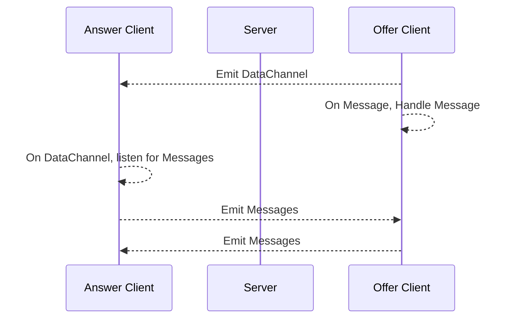

This is a high-level overview of the sequence of events that occur while using Liquid Auth.
See the [Getting Started](./guides/getting-started) section for more detailed information on each step.
**NOTE: **Diagrams are generated using [Mermaid](https://mermaid-js.github.io/mermaid/#/).

## Authentication

A user can link their device to a website by scanning a QR code. 
To initiate this process, the website subscribes to a WebSocket channel to monitor the link status. 
Once the user scans the QR code with their wallet, the wallet sends a [FIDO2 PublicKeyCredential](https://w3c.github.io/webauthn/#publickeycredential) to the server for validation. 
The server then verifies the FIDO2 credential and responds with the link status to both the wallet and the website.
The following diagram is a visual representation of these steps:

## Signaling

The website and wallet can connect to a dedicated WebSocket channel specifically for exchanging [Session Description](https://developer.mozilla.org/en-US/docs/Glossary/SDP) answers and offers. Additionally, [ICE Candidates](https://developer.mozilla.org/en-US/docs/Web/API/RTCPeerConnection/icecandidate_event) are identified when any peer has both an offer and an answer.

### Offer

[Offers](https://datatracker.ietf.org/doc/html/rfc3264) are created by a peer and transmitted through the signaling service. 
A client that has made an offer will listen for an answer description from the responding peer. 
It's important to note that answers are only sent in response to a specific offer. 
Clients that create offers are also responsible for creating the [Data Channel](https://developer.mozilla.org/en-US/docs/Web/API/RTCDataChannel) for data exchange.

### Answer

An [Answer](https://datatracker.ietf.org/doc/html/rfc3264#page-19) is created by a peer in response to an offer.
The answer includes both the answer description and ICE candidates, which are then sent to the signaling service for further processing.

### Data Channel

Once an Offer and Answer have been exchanged, a [Data Channel](https://developer.mozilla.org/en-US/docs/Web/API/RTCDataChannel) will be emitted to the peer who created the answer. This channel allows for real-time message exchange between the website and wallet over the P2P connection.

