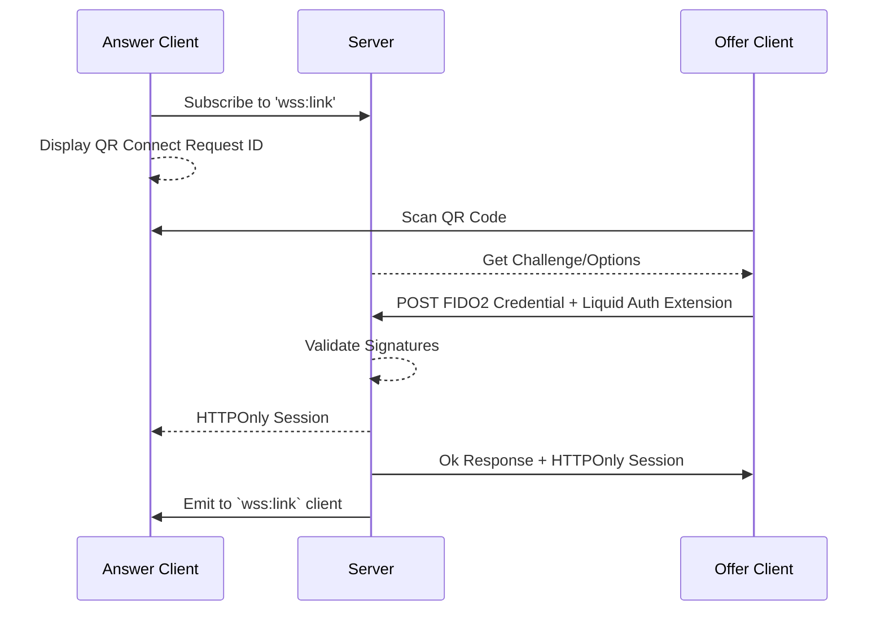
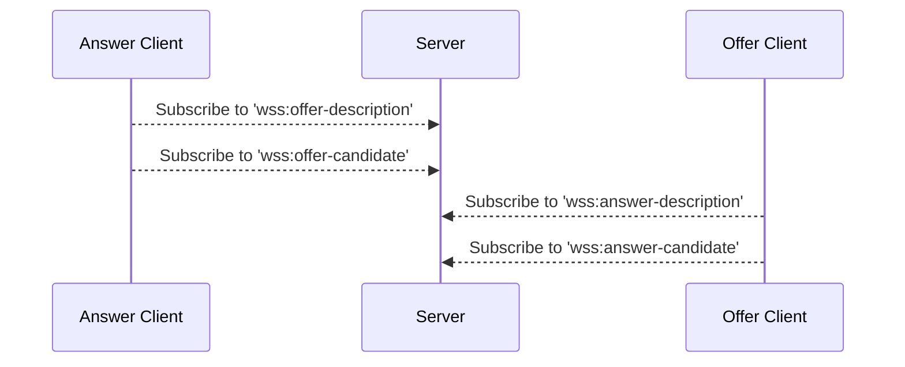
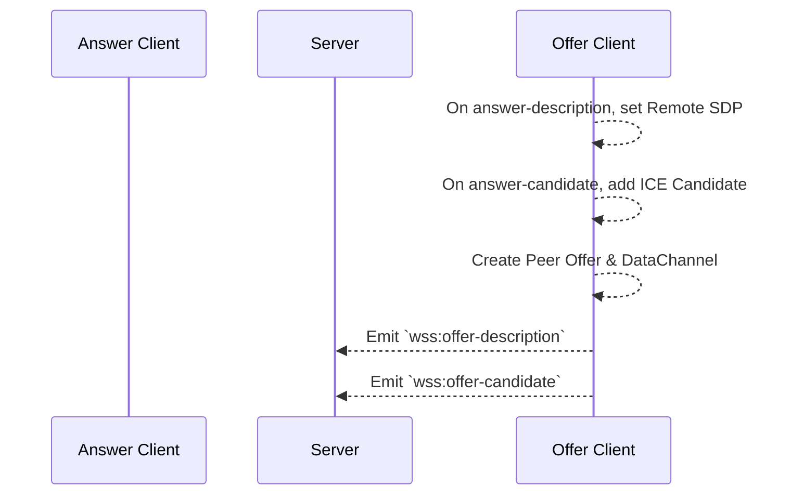
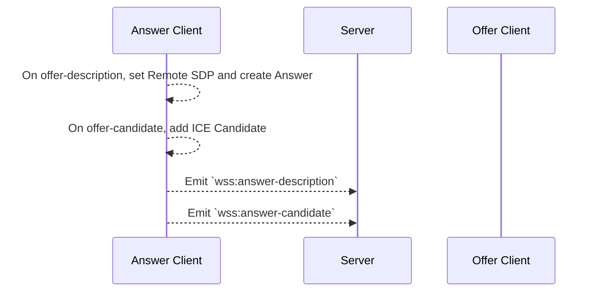
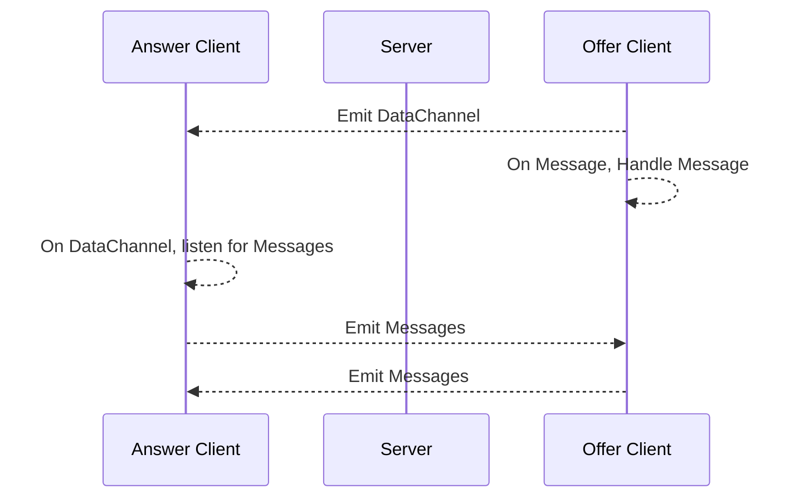
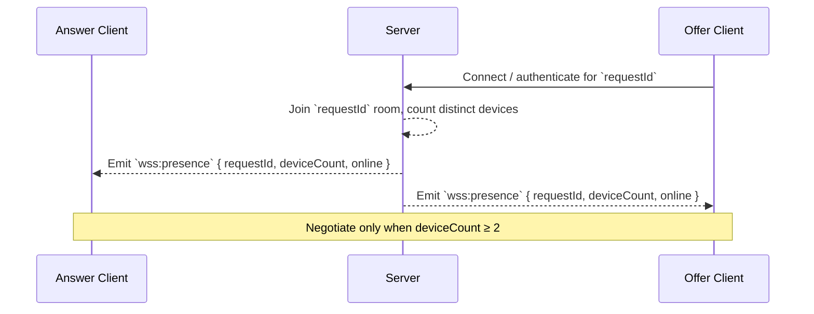
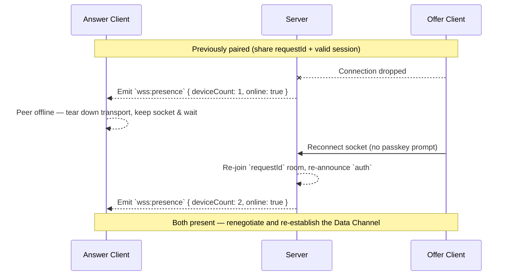

This is a high level overview of the sequence of events that happens while using Liquid Auth.
See the [Getting Started](../guides/getting-started) section for more detailed information on each step.
Diagrams are generated using [Mermaid](https://mermaid-js.github.io/mermaid/#/).

## Authentication

A user can link their device to a website by scanning a QR code. 
The website will subscribe to a WebSocket channel to receive the link status. 
The wallet will scan the QR code and send a [FIDO2 PublicKeyCredential]() to the server. 
The server will validate the FIDO2 credential and send a response to the wallet and website.

## Signaling

The website and wallet can subscribe to an isolated WebSocket channel to broker [Session Description]() answers and offers.
[ICE Candidates]() are discovered when any peer has both an offer and answer.

Signaling is keyed on the `requestId` rather than the wallet address. When a client
subscribes to `wss:link`, and when a wallet authenticates against a `requestId`, the
server joins that socket to the `requestId` room. Descriptions and candidates are then
brokered to that room, so negotiation works before the peer has authenticated and no
longer depends on the wallet address.

### Offer

[Offers]() are created by a peer and sent through the signaling service. 
A client with an offer will listen for an answer description. 
Answers are only emitted in response to an offer.
Offer clients are responsible for creating the [Data Channel]().

### Answer

An [Answer]() is created by a peer in response to an offer.
The answer description and candidates are emitted to the signaling service.

### Data Channel

Once an Offer and Answer have been exchanged, a [Data Channel]() will be emitted to the peer who created the answer.
This channel is used to send messages between the website and wallet in real-time over the established P2P connection.

## Presence

Whenever a socket joins or leaves a `requestId` room the server broadcasts a
`wss:presence` event to that room. Peers use it to decide whether the other party is
available before attempting to (re)negotiate, and only negotiate once both peers are
present (`deviceCount >= 2`).

`deviceCount` counts distinct devices — sockets are collapsed by their session id, so a
device that briefly owns more than one socket (e.g. a lingering socket plus a fresh
reconnect) is only counted once. `online` is `true` when at least one device is present.
`GET /auth/session` reports the same live `deviceCount`.

## Reconnection

Because both peers persist the `requestId` and the wallet retains a valid session, a
dropped P2P connection is renegotiated over the existing socket without a fresh passkey
prompt. The server re-announces `auth` when a bound wallet reconnects (or when the peer
links while the wallet is already present), and both sides re-run the offer/answer
exchange in the `requestId` room.

