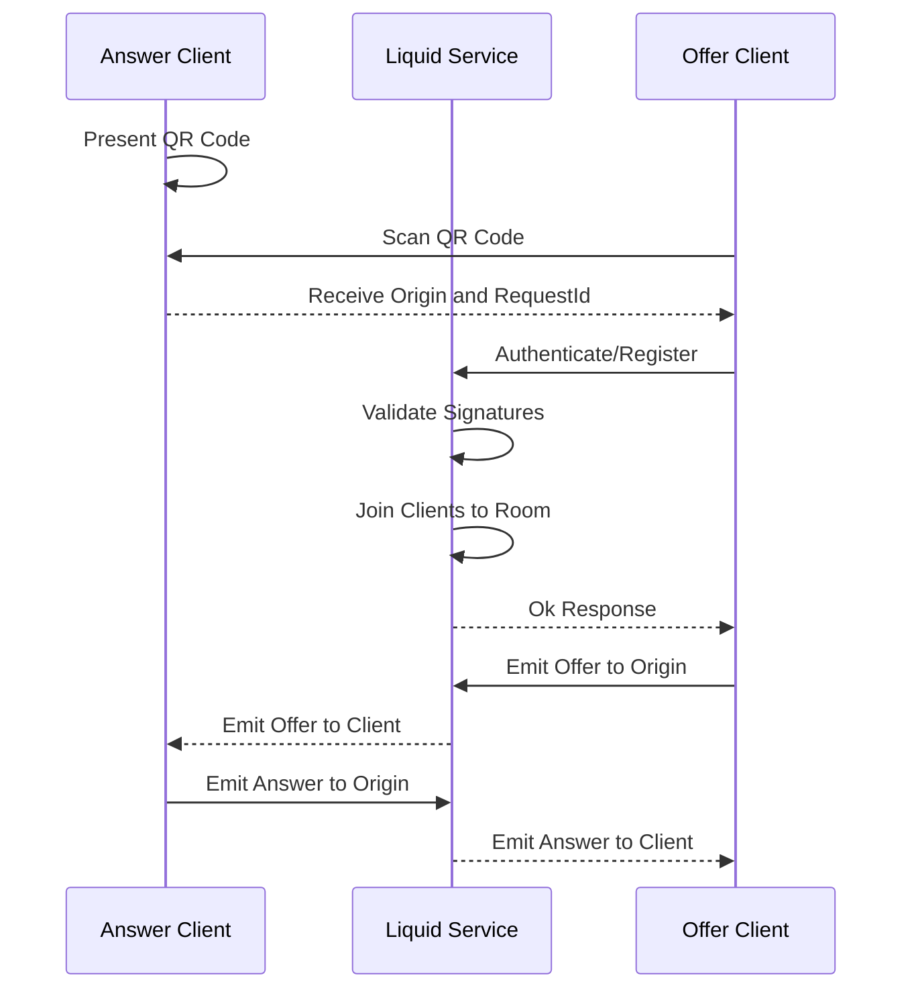
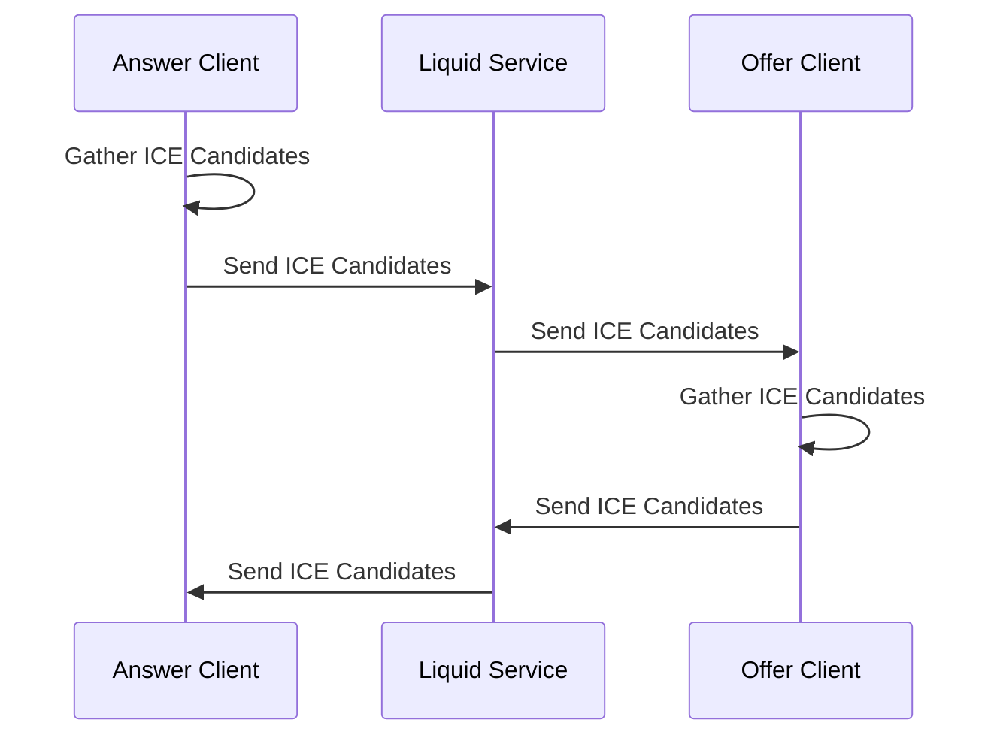
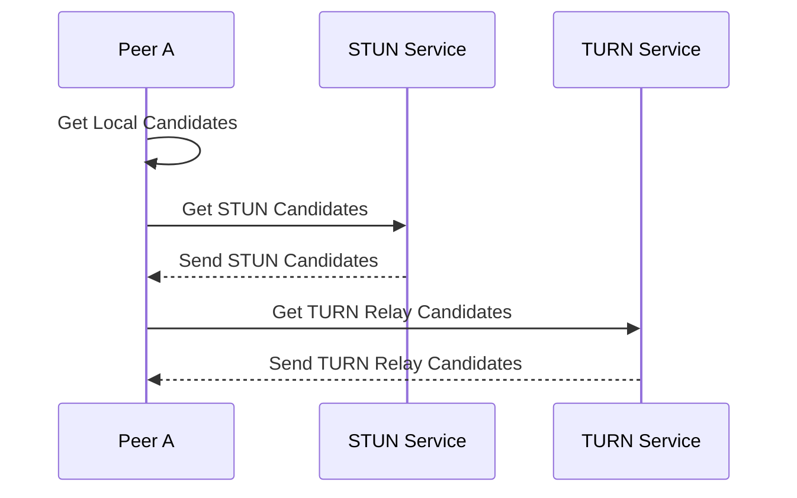

In a peer-to-peer (P2P) session, both **Offer** and **Answer** clients use a relay service to listen for each other's messages. Once the [Deep Link](/guides/linking/#deep-link) is delivered, the **Offer** client authenticates its identity using the [Liquid Extension](/guides/passkey/extension). This ensures the legitimacy of the client before initiating the exchange. 

The process proceeds with the **Offer** client sending an **Offer** message to the **Answer** client. In response, the **Answer** client finalizes the exchange by sending an **Answer** message back to the **Offer** client, completing the P2P connection.

## ICE Candidates

To ensure a direct and efficient connection, both clients exchange ICE (Interactive Connectivity Establishment) candidates. These candidates help the clients determine the best network path for data transfer. The ICE candidate exchange occurs over WebSockets using the signaling server.

### Candidate Discovery

In some cases, a direct peer-to-peer connection may not be possible, especially when clients are behind firewalls or [NATs](https://developer.mozilla.org/en-US/docs/Glossary/NAT). To address this, STUN (Session Traversal Utilities for NAT) and TURN (Traversal Using Relays around NAT) servers are employed as a fallback mechanism.
- STUN servers discover the client's public IP address and help establish the connection when NAT is involved.
- TURN servers relays the data if the direct connection cannot be established, ensuring communication between the clients.

The following diagram outlines the exchange process with STUN and TURN services:

By leveraging these ICE candidates and fallback mechanisms, Liquid Service ensures robust peer-to-peer communication, even in complex networking environments.
