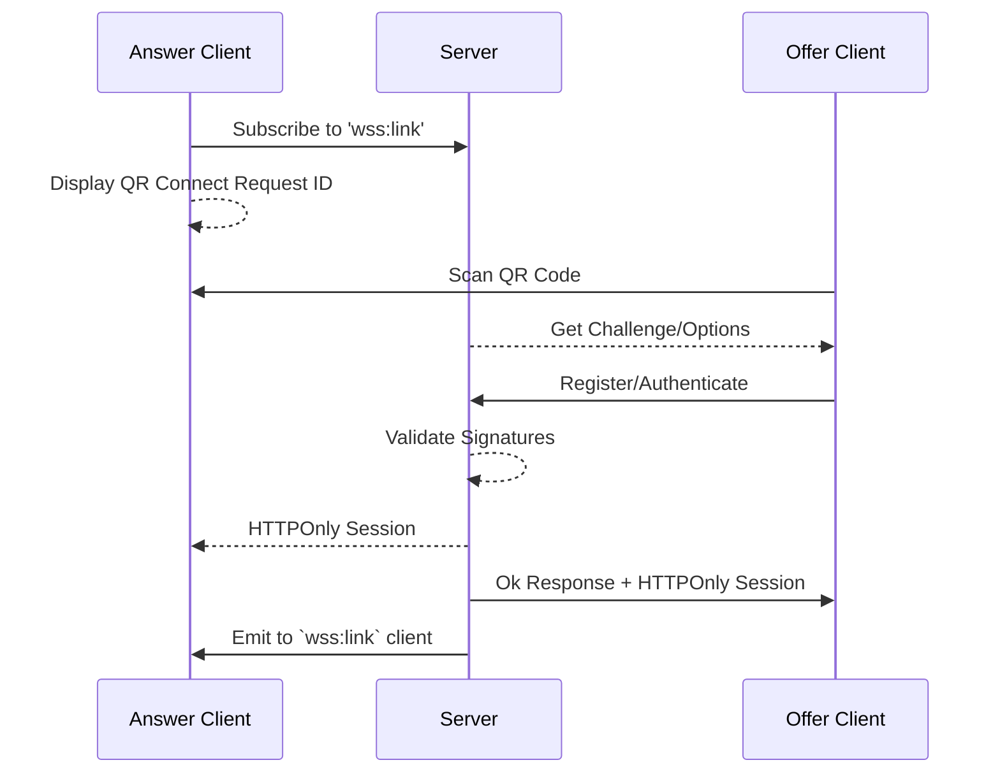

import { Aside } from "@astrojs/starlight/components";

<Aside>
  We recommend following the Peer-to-Peer guides to learn how to establish a connection between clients.
</Aside>

A link authorizes a remote client to access the service by generating a `requestId` and waiting for a device to attest a [Passkey](/guides/concepts/#-passkeys).

The service acknowledges a link event only after the remote client successfully authenticates. This linking process utilizes a [Deep Link](#deep-link) and a [QR Code](#qr-code). The SignalClient generates the deep link and presents it to the other client.

The remote client handles the **Deep Link** by submitting a **Passkey** along with the [Liquid Extension](/guides/passkey/extension) to the origin service. Once the service validates the linking request, the client can communicate with the service and establish a peer-to-peer connection."


### Who is this for?

- **dApps/Wallets** projects looking to integrate with `Liquid Auth`.


## Deep Link

Liquid uses a custom deep link to facilitiate linking between devices. The link format is as follows:

```
liquid://<ORIGIN>/?requestId=<UUID_OF_REQUEST>
```

This link will be used to generate a QR code for the user to scan with their devices.

#### Origin

The origin refers to the server responsible for processing the linking request.


#### Request ID

The request ID is a UUID generated by the client to uniquely identify the linking request.

## QR Code

We recommend displaying the deep link as a QR code for users to scan with their devices.
To try it out, download the [demo Android](https://github.com/algorandfoundation/liquid-auth-android/releases) application and scan the QR code below.

<div id="parent-div" hx-get="/demo/"
     hx-trigger="load"
     hx-swap="innerHTML">Loading</div>


### Diagram

This diagram illustrates the linking process between a website and a wallet.


